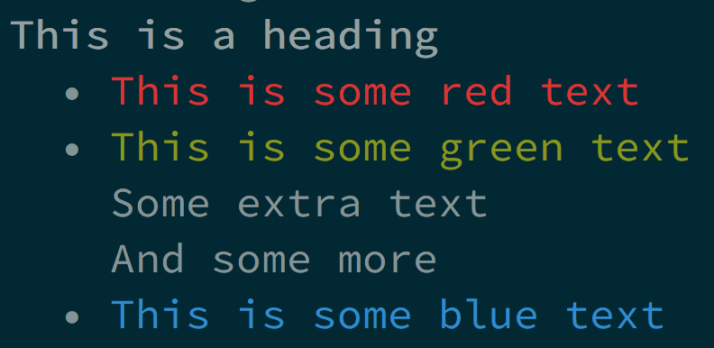

# pretty-term

[](https://clojars.org/tcsavage/pretty-term)

Hiccup-like DSL for pretty-printed terminal output.

Pretty-term provides two sets of features under a unified DSL: layout and ANSI formatting.

The layout side is based on "The Design of a Pretty-printing Library" _(Hughes 1995)_.

## Example

```clojure
(def document
  [:lines
    [:bold "This is a heading"]
    [:bullets
      [:color :red "This is some red text"]
      [:lines
        [:color :green "This is some green text"]
        "Some extra text"
        "And some more"]
      [:color :blue "This is some blue text"]]])

(require '[pretty-term.core :as pretty])

(println (pretty/render document))
```



## API

The namespace `pretty-term.core` exports a single function `(render dsl)` which will interpret the `dsl` input and generate a string.

```clojure
(require '[pretty-term.core :refer [render]])

(println
  (render
    [:lines "Line one"
            "Line two"
            "Line three"]))
```

## Layout

#### nil
Empty document.

#### strings
Text document.

#### `[:text string]`
Simply renders `string` as regular text.

#### `[:lines & docs]`
Vertically concatenates `docs` by putting each of them on their own line.

#### `[:nest & docs]`
Creates a new nested block.

#### `[:align & docs]`
Creates a new nested block.

#### `[:cat & docs]`
Horizontally concatenates `docs` together.

#### `[:bullets & docs]`
Vertically concatenates `docs` as a bulleted list.

## ANSI

#### `[:bold doc]`
Renders `doc` in a bold typeface.

#### `[:italic doc]`
Renders `doc` in an italic typeface.

#### `[:underline doc]`
Renders `doc` in an underlined typeface.

#### `[:color color doc]`
Renders `doc` with the foreground color set to `color`. _(see colors)_

#### `[:background color doc]`
Renders `doc` with the background color set to `color`. _(see colors)_

### Colors

The following values for color are supported:

  * `:black`
  * `:white`
  * `:red`
  * `:green`
  * `:blue`
  * `:cyan`
  * `:magenta`
  * `:yellow`
  * `:default`

